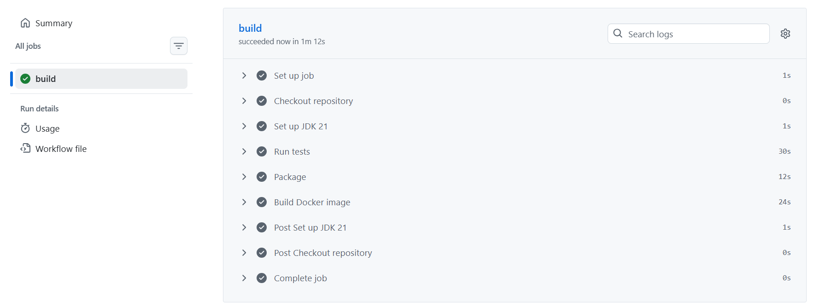

# MongoDB Test

Projeto Java 21 com Spring Boot 3, Spring Web, Spring Data MongoDB, Lombok, Docker e Docker Compose.

## Executar

```bash
docker compose up -d
mvn spring-boot:run
```

Por padrao, a aplicacao usa:

- MongoDB: `localhost:27017`
- Database: `people_db`
- Usuario: `admin`
- Senha: `admin123`

Esses valores podem ser alterados por variaveis de ambiente:

```bash
MONGO_USERNAME=myuser MONGO_PASSWORD=mypass MONGO_DATABASE=mydb docker compose up -d
MONGO_USERNAME=myuser MONGO_PASSWORD=mypass MONGO_DATABASE=mydb mvn spring-boot:run
```

## cURL

Criar pessoa:

```bash
curl -X POST http://localhost:8080/api/people \
  -H "Content-Type: application/json" \
  -d '{"name":"Ada Lovelace","email":"ada@example.com"}'
```

Listar pessoas:

```bash
curl http://localhost:8080/api/people
```

## Pipeline CI/CD com GitHub Actions

Este projeto possui uma pipeline de CI configurada no arquivo `.github/workflows/ci.yml`.

A pipeline e executada automaticamente quando houver `push` ou abertura/atualizacao de `pull request` na branch `master`.

Ela executa as seguintes etapas:

- Baixa o codigo do repositorio com `actions/checkout`.
- Configura o Java 21 com `actions/setup-java`.
- Executa os testes automatizados com `mvn test`.
- Gera o pacote da aplicacao com `mvn package`.
- Gera a imagem Docker da aplicacao com `docker build`.

O teste de integracao utiliza Testcontainers para subir um MongoDB durante a execucao da pipeline, permitindo validar a integracao com o banco sem depender de uma instancia externa.


